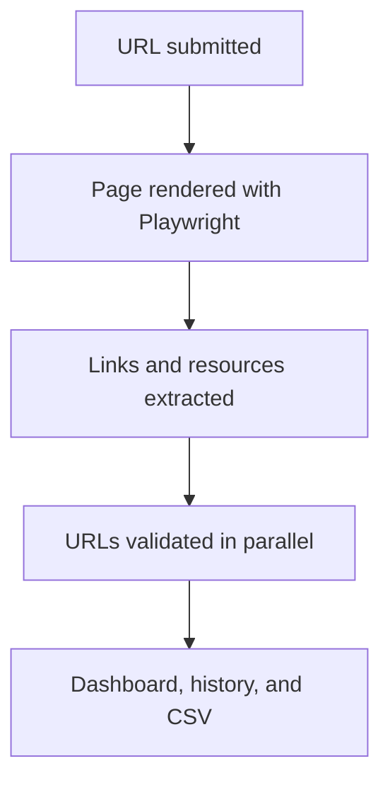

# ATLAS

> A link checker and website quality analysis tool focused on reliability, accessibility, relevance, authority, and performance.


ATLAS helps developers, QA teams, and content owners find broken links, redirects, certificate problems, timeouts, and unreachable resources without checking every URL manually.

Unlike a basic HTML crawler, it uses Playwright to render JavaScript-powered pages before extracting and validating their content. Results are presented in a searchable local dashboard with a health score, scan history, and CSV export.

## ✨ Highlights

- **JavaScript-aware scanning** with Playwright and Chromium
- **Actionable classification** for valid, redirected, broken, and unreachable links
- **Page health score** with a summary of items that need attention
- **Detailed diagnostics** including response time, final URL, redirect chain, and error details
- **Flexible scope** with optional external-link and technical-asset scanning
- **Local-first workflow** with browser dashboard, scan history, and CSV export
- **Simple Windows launcher** that prepares the environment and opens the application

## 🚀 Quick Start

### Requirements

- Windows 10 or later, or a supported Linux distribution
- Python 3.13 or later available on `PATH`
- Internet access during the first setup to download Chromium

### Windows

Clone the repository and open its directory:

```powershell
git clone [https://github.com/wglgc997/ATLAS.git]
cd ATLAS
```

Start the application:

```powershell
.\start.bat
```

The launcher automatically:

1. Creates a local virtual environment.
2. Installs the Python dependencies.
3. Downloads or verifies Playwright Chromium.
4. Starts the FastAPI application.
5. Opens the dashboard in your default browser.

The application is available at `http://127.0.0.1:8000`. Keep the terminal open while using it and press `Ctrl+C` to stop the server.

### Linux

Clone the repository and open its directory:

```bash
git clone [https://github.com/wglgc997/ATLAS.git]
cd ATLAS
```

Create and activate a virtual environment:

```bash
python3 -m venv .venv
source .venv/bin/activate
```

Install the application dependencies and Playwright Chromium:

```bash
python -m pip install --upgrade pip
python -m pip install -r requirements.txt
python -m playwright install --with-deps chromium
```

Start the application:

```bash
python launcher.py
```

Open `http://127.0.0.1:8000` if the dashboard does not open automatically. Keep the terminal running and press `Ctrl+C` to stop the application.

## 🖥️ Using the Dashboard

1. Enter the complete URL of the page you want to inspect.
2. Choose whether to include external links and technical assets.
3. Start the analysis.
4. Review the health score and prioritized summary.
5. Filter, search, or sort the detailed results.
6. Export the visible result set to CSV when needed.

Every completed scan is stored locally in `data/scan_history.json` and can be reopened from the dashboard.

## 🔍 What the Scanner Detects

| Category | Examples |
| --- | --- |
| Healthy | Successful HTTP 2xx responses and working interactive elements |
| Redirected | Links that follow one or more redirects and reach a valid destination |
| Broken | HTTP 4xx/5xx responses, invalid links, permission failures, and redirect loops |
| Connection errors | DNS failures, timeouts, SSL errors, and unreachable servers |
| Page resources | Anchors, images, scripts, stylesheets, and iframes |

Each result may include its original URL, final URL, HTTP status, redirect chain, response time, source element, and a human-readable explanation.

## 🏗️ How It Works



The application follows a layered design: the FastAPI routes receive scan requests, the crawler renders and extracts page content, services normalize and filter URLs, and the checker validates each resource before the summary is generated.

## 🛠️ Manual Installation

The Windows launcher is the simplest setup option. The application can also be configured manually on Windows, Linux, or macOS:

```bash
python -m venv .venv
```

Activate the environment:

```powershell
# Windows
.\.venv\Scripts\activate
```

```bash
# Linux or macOS
source .venv/bin/activate
```

Install the application and Chromium:

```bash
python -m pip install --upgrade pip
python -m pip install -r requirements.txt
python -m playwright install chromium
python launcher.py
```

## ⚙️ Configuration

The application works without a `.env` file. Create one in the project root only when you need to override the defaults:

```env
HTTP_TIMEOUT=20
HTTP_RETRIES=2
HTTP_RETRY_BACKOFF=0.5
PLAYWRIGHT_TIMEOUT=60
PLAYWRIGHT_INTERACTION_TIMEOUT=3
VERIFY_SSL=true
CA_BUNDLE_PATH=
WAIT_UNTIL=domcontentloaded
MAX_REDIRECTS=10
```

| Variable | Default | Purpose |
| --- | --- | --- |
| `HTTP_TIMEOUT` | `20` | Maximum time for each HTTP validation request |
| `HTTP_RETRIES` | `2` | Retry attempts for connection failures and timeouts |
| `HTTP_RETRY_BACKOFF` | `0.5` | Delay multiplier between retries |
| `PLAYWRIGHT_TIMEOUT` | `60` | Maximum page rendering time |
| `PLAYWRIGHT_INTERACTION_TIMEOUT` | `3` | Maximum time for an interaction check |
| `VERIFY_SSL` | `true` | Enables SSL certificate verification |
| `CA_BUNDLE_PATH` | Empty | Optional path to a trusted PEM certificate bundle |
| `WAIT_UNTIL` | `domcontentloaded` | Playwright page-load state used before extraction |
| `MAX_REDIRECTS` | `10` | Maximum redirects followed during validation |

For internal websites with a private certificate authority, keep verification enabled and configure the certificate bundle:

```env
VERIFY_SSL=true
CA_BUNDLE_PATH=C:\path\to\corporate-ca.pem
```

Use `VERIFY_SSL=false` only in a controlled environment. Never commit `.env` files or private certificates.

## 🔌 API

FastAPI provides interactive API documentation at `http://127.0.0.1:8000/docs` while the application is running.

| Method | Endpoint | Purpose |
| --- | --- | --- |
| `GET` | `/health` | Check application availability |
| `GET` | `/` | Open the dashboard |
| `POST` | `/scans` | Analyze a page |
| `GET` | `/scans/history` | List locally stored scans |
| `GET` | `/scans/history/{scan_id}` | Retrieve a stored scan |

Example scan request:

```json
{
  "url": "https://example.com",
  "timeout": 20,
  "max_workers": 12,
  "include_assets": false,
  "include_external": true
}
```

## 📁 Project Structure

```text
Quality-Link-Checker/
├── data/                   # Local scan history
├── src/
│   ├── api/                # FastAPI routes
│   ├── checker/            # HTTP validation
│   ├── config/             # Runtime settings
│   ├── crawler/            # HTML and browser extraction
│   ├── schemas/            # API data models
│   ├── services/           # Scan orchestration and summaries
│   ├── static/             # Dashboard CSS and JavaScript
│   ├── templates/          # Dashboard templates
│   └── web.py              # FastAPI application
├── tests/                  # Automated tests
├── launcher.py             # Local application launcher
├── start.bat               # Windows setup and startup script
├── requirements.txt        # Runtime dependencies
└── requirements-dev.txt    # Development tools
```

## 🧪 Development

Install the development dependencies:

```bash
python -m pip install -r requirements-dev.txt
```

Run the tests:

```bash
python -m pytest
```

Start the application with automatic reload:

```bash
uvicorn src.web:app --reload --host 127.0.0.1 --port 8000
```

## ⚠️ Current Limitations

- The application scans one page per request; it does not crawl an entire website recursively.
- Some websites may block automated HTTP requests or browser automation.
- Scan history is stored locally and is not synchronized between computers.
- Windows provides the automated `start.bat` setup; Linux and macOS currently use the documented manual setup.

## 🗺️ Roadmap

- [x] JavaScript-rendered page scanning
- [x] Link and resource validation
- [x] Page health score and prioritized summary
- [x] Searchable and filterable dashboard
- [x] Local scan history
- [x] CSV export
- [x] Core automated tests
- [ ] Live progress feedback during long scans
- [ ] Packaged Windows release

## 🤝 Contributing

Bug reports, ideas, and pull requests are welcome. To contribute:

1. Fork the repository.
2. Create a feature branch.
3. Implement and test your changes.
4. Open a pull request describing the problem and your solution.

You can also [open an issue](https://github.com/wglgc997/Quality-Link-Checker/issues) to report a bug or suggest an improvement.

## 👤 Author

Created by [Wagner Carvalho](https://github.com/wglgc997) as a practical project in Python backend development, browser automation, web quality analysis, and local application distribution.

## 📄 License

Distributed under the MIT License. See [`LICENSE`](LICENSE) for details.
